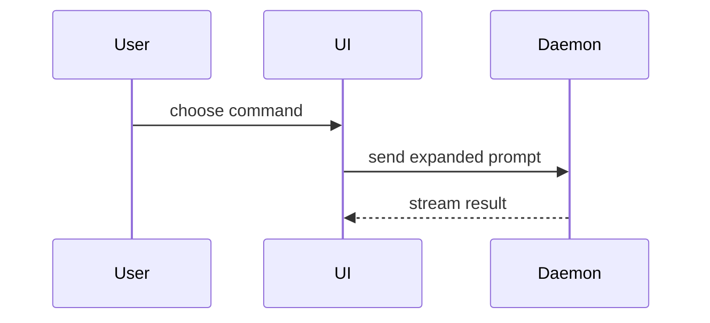

PR 본문을 작성할 때 이 템플릿을 사용하세요.

```markdown
## Summary

<diagram, diff-sketch, or tree>

## Evidence

- **Before:** <screenshot/output/failing test run>
  **After:** <screenshot/output/passing test run>

## Merge Danger

**Door:** <one-way or two-way>

<optional: description>

**Blast Radius:** <one-word description>

<optional: potential ramifications of merge>
```

## 섹션

서두는 모두 생략하고 문장은 간결하게 유지하세요. `CONTEXT.md`에 있는 사용자의 도메인 언어를 사용하세요.

### 요약(Summary)

핵심을 분명하게 보여 주는 가장 작은 뷰를 고르세요.

- 로직이나 알고리즘은 의사 코드(pseudocode)로 보여 주세요.

```text
on(save)
  if content is unchanged
    return cached result
  write new content
  return fresh result
```

- 런타임 제어 흐름은 호출 트리(call tree)로 보여 주세요.

```text
submitForm
  createSession
    persistPrompt
    launchAgent
  navigateToSession
```

- UI 구조는 중요한 상태와 모듈 경계를 포함한 컴포넌트 트리로 보여 주세요.

```tsx
<SessionPage>(apps / example / src / routes / session.tsx);
useSessionEvents() < SessionToolbar > <RunSkillButton>(packages / ui);
```

- 파일별 책임이나 광범위한 리팩터링은 얕은 파일 트리로 보여 주세요.

```text
src/
├── commands/       # 사용자 액션을 파싱함
├── sessions/       # 세션 상태를 소유함
└── transport/      # API 요청을 보냄
```

- 컴포넌트 상호작용, 제어 흐름, 데이터 흐름은 Mermaid로 보여 주세요.



- 무엇이 바뀌는지가 핵심이고 주변 구조가 이미 존재할 때는 `diff`를 사용하세요. diff의 형태를 주제에 맞추세요.

컴포넌트 변경의 경우:

```diff
 <SessionPage>
   useSessionEvents()
   <SessionToolbar>
+    <RunSkillButton />
   <SessionTimeline>
+    <SkillResultCard />
```

파일 구조 변경의 경우:

```diff
 src/
 ├── commands/
+│   └── show-me.ts       # 슬래시 명령을 확장함
 ├── sessions/
-└── transport.ts
+└── transport/
+    ├── client.ts
+    └── stream.ts
```

호출 트리 또는 호출 스택 변경의 경우:

```diff
 submitForm
   createSession
     persistPrompt
+    expandSkillMention
     launchAgent
-  navigateToSession
+  navigateToSession
+    subscribeToEvents
```

상태 또는 제어 흐름 변경의 경우:

```diff
 on(save)
-  write content
+  if content is unchanged
+    return cached result
+  write new content
+  invalidate cache
```

- 대부분이 새로운 내용일 때, 컨텍스트를 생략하면 소유 관계나 순서가 가려질 때, 또는 사용자가 복사할 수 있는 목표 형태가 필요할 때는 블록 전체를 보여 주세요.

```ts
function expandSkill(command: string): string {
  const skillName = command.slice(1);
  return `use the ${skillName} skill`;
}
```

#### 지침

각 시각 자료는 그것이 뒷받침하는 짧은 글 바로 옆에 두세요. 사용자의 현재 질문에 답하거나 현재 논의 사항을 해결할 선택지를 제시하는 데 필요한 호출, 파일, props, 상태, 경계만 남기세요.

이 중 하나만 쓸 수도, 여러 개를 쓸 수도 있지만, 전부 쓸 일은 거의 없습니다. 판단력을 발휘하고 사용자를 압도하지 마세요.

### 증거(Evidence)

변경이 제대로 동작한다는 구체적인 증거입니다. 이전과 이후를 보여 주세요.

스크린샷은 S등급입니다. 환경이 갖춰져 있고 시각적인 변경일 때 해당합니다.

실행 기반 증거는 A등급입니다. 테스트 결과, 콘솔 출력 등이 해당합니다. 이전에는 실패하고 이제는 통과하는 정확한 테스트를 의사 코드로 보여 주세요.

### 병합 위험도(Merge Danger)

단방향 문(one-way door)인지 양방향 문(two-way door)인지 설명하세요. 양방향 문은 되돌아 나올 수 있지만 단방향 문은 그럴 수 없습니다. 롤백 비용이 적은 PR일수록 위험이 낮습니다. 파괴적인 작업이나 되돌리기 어려운 결정이 포함된 변경은 단방향 문입니다.

영향 범위(blast radius)는 이 PR이 도입하는 변경의 잠재적 영향 또는 범위입니다. 모든 가능성을 고려하세요. 예를 들어 레이아웃 이동(layout shift), 사용하는 쪽(consumer)의 기능 손상, 모바일 반응형 등이 있습니다.
